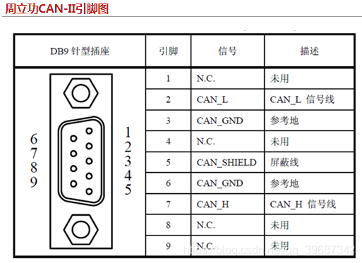

# Kvaser CAN 驱动

https://www.kvaser.cn/downloads/
https://www.kvaser.com/?s=Kvaser+Linux+Drivers+and+SDK&utm_source=software&utm_ean=7330130980754&utm_status=latest

下载：
    Kvaser Linux Drivers and SDK 支持绝大多数Kvaser设备的Linux驱动与SDK，专用于Kvaser的特有API。如要使用SocketCAN，请勿安装。

```Bash
    make
    sudo make uninstall
    sudo make install
    sudo make load
```

**DB9 CAN接口的定义：**信号引脚在2与7，因CAN的CAN_H与CAN_H对应，CAN_L与CAN_L一一对应，所以RS485的公母头不存在信号不一致的情况。 DB9 : 7脚CANH，2脚CANL，RJ45 1脚CANH，2较CANL

